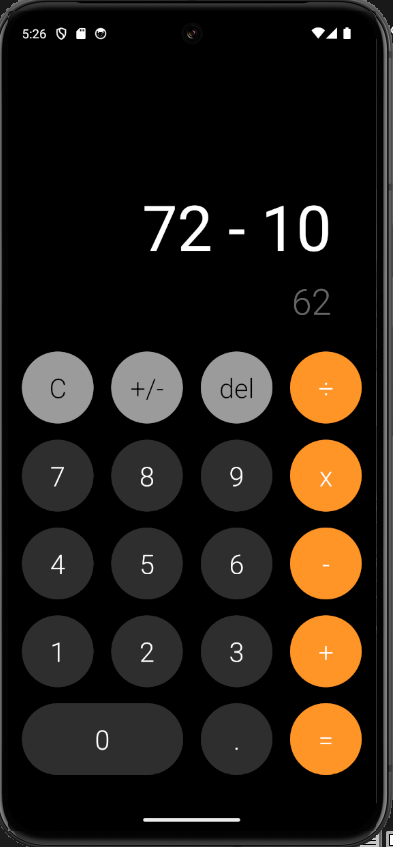
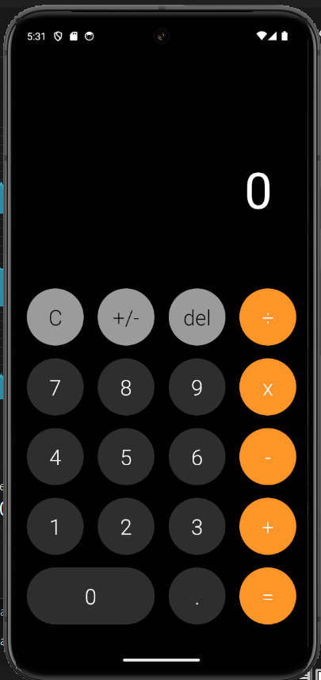

## Android Calculator Clone

This README provides a brief description of a calculator clone app developed using React Native. The app aims to replicate the functionality of a basic calculator, allowing users to perform arithmetic operations on numbers.

The app utilizes React Native, a popular JavaScript framework for building mobile applications. React Native enables developers to write code once and deploy it on both iOS and Android platforms, making it a convenient choice for cross-platform app development.

In addition to React Native, the app also leverages other tools and libraries to enhance its functionality. These include:

- React Native
By combining these tools, the calculator clone app provides users with a familiar and intuitive interface for performing calculations on their mobile devices.

 
